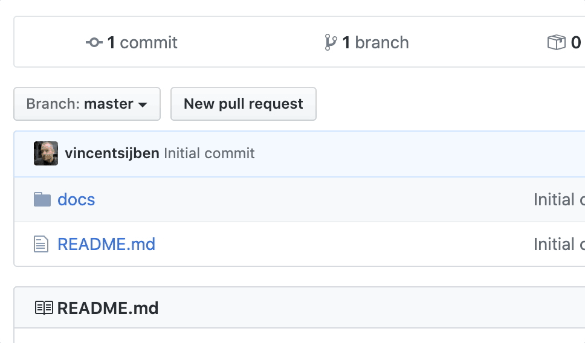
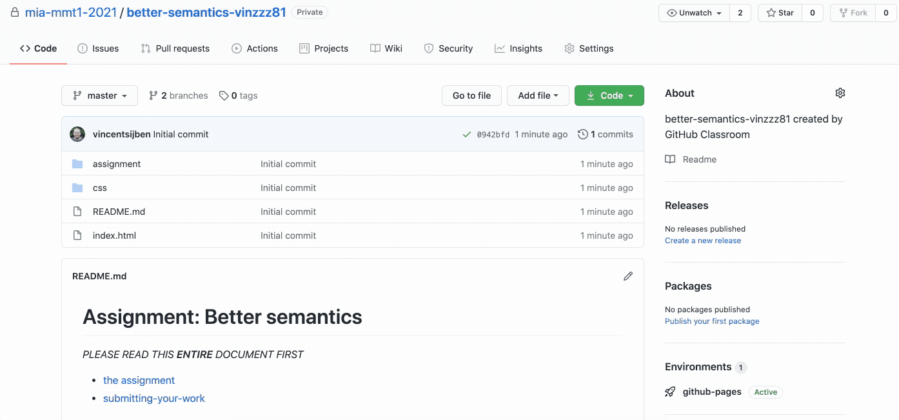

# Assignment The Godfather

*PLEASE READ THIS **ENTIRE** DOCUMENT FIRST*

* [the assignment](#the-assignment)
* [submitting-your-work](#submitting-your-work)


## The assignment

Download the code in this repo to your local machine and run the website. You'll see the first 2 parts of The Godfather series. Your job is to add the third part as well (title and image).

Make sure that this edited website works on your local machine. 

You only need to upload the new ```index.html``` and ```img``` folder once your ready (you don't need to upload the README or assignment folder into the gh-pages branch).

## Submitting your work
Inside this assignment repo, create a new branch called **gh-pages** and upload your local work into this branch, **not** in the master branch:



By creating this **gh-pages** branch, you'll automatically publish your work to ```https://<organisation>.github.io/<assignment>-<user>/```. For example: ```https://mia-mmt1-2021.github.io/assignment-1a-bond007/```.

To 'submit' your work, click the **new pull request** button in the Pull requests tab (next to the Code and Issues tab). 
  * Choose **base:master** and **compare:gh-pages** and click the **Create pull request** button.
  * Select **vincentsijben** or **willmuijrers** or **lucvansoest** as a reviewer in the sidepanel on the right (only select 1)
  * Be sure to put the published GitHub Pages URL in the comment section.
  * Do **not** merge this Pull Request yourself. That's up to the reviewer to decide (merging is approving the assignment).
  
  
